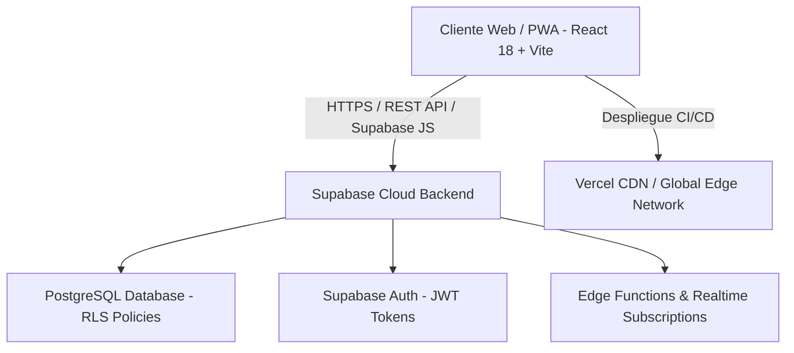

# INFORME TÉCNICO FORMAL DE SOFTWARE
## REGISTRO DE LA PROPIEDAD INTELECTUAL Y DERECHOS DE AUTOR

---

> **DOCUMENTACIÓN TÉCNICA OFICIAL PARA PERITAJE Y DEPÓSITO LEGAL**
> **Nombre de la Obra:** Padel ID (Plataforma Multi-tenant SaaS para Gestión Integral de Torneos de Pádel)  
> **Autoría / Titularidad:** Anita Quiroga  
> **Tipo de Obra:** Software de Aplicación / Plataforma Web Cloud-Native  
> **Fecha de Depósito:** Agosto 2026  
> **Estado de Despliegue:** Operativo en producción (Cloud-Native SaaS)

---

## 1. DATOS DE IDENTIFICACIÓN DE LA OBRA

* **Denominación Oficial de la Obra:** Padel ID
* **Subtítulo / Marca Comercial:** Plataforma Multi-tenant para la Gestión de Torneos, Zonas, Llaves de Play-off y Ranking Unificado de Pádel.
* **Autora y Titular de Derechos:** Anita Quiroga
* **Organización / Marca:** Goodsports (`@goodsports.jb`)
* **Naturaleza Jurídica y Técnica:** Obra de software inédita / Plataforma de software como servicio (SaaS) basada en arquitectura de nube.
* **Licencia / Régimen de Propiedad:** Derechos reservados a nombre de la autora.

---

## 2. DESCRIPCIÓN FUNCIONAL Y MÓDULOS DEL SISTEMA

**Padel ID** es una plataforma web integral diseñada para automatizar la organización de torneos de pádel en modalidades oficiales (por parejas), americanos (individuales y por parejas) y circuitos anuales inter-clubes.

### Módulos Principales del Software:

1. **Portal Público y Mural interactivo (`TorneoPublico.tsx`, `TorneoIndividualPublico.tsx`, `RankingPublico.tsx`)**:
   * Interfaz pública responsiva adaptada a PWA (Progressive Web App).
   * Permite a los jugadores y espectadores consultar en tiempo real las zonas, horarios de partidos, resultados, llaves de eliminación directa y tablas de posiciones sin necesidad de autenticación previa.

2. **Gestión de Inscripciones y Verificación de Pagos (`Inscripciones.tsx`, `InscripcionPublica.tsx`)**:
   * Registro automatizado de parejas e individuos con control de disponibilidad horaria y franjas preferenciales.
   * Gestión de estados de pago (pendiente, parcial, pagado) con adjunto de comprobantes y validación administrativa.

3. **Motor Algorítmico de Zonas y Play-offs (`GeneradorZonasAuto.ts`, `Torneos.tsx`)**:
   * Algoritmo inteligente para la distribución automática de parejas en zonas de 3 o 4 equipos según ranking y siembras.
   * Cómputo automático de posicionales mediante diferencia de sets y games.
   * Generación dinámica de llaves de play-off (16avos, 8vos, 4tos, semifinales y final) con soporte para cuadro de 4, 8, 16, 32 y 48 parejas.

4. **Sistema Unificado de Ranking y Reglas de Ascenso (`Ranking.tsx`, `useClubRanking.ts`, `ranking.ts`)**:
   * Cálculo automatizado de puntos por fecha disputada según la instancia alcanzada (Campeón, Subcampeón, Semifinalista, Cuartofinalista, etc.) y multiplicador del torneo.
   * Regla de transferencia del 50% de puntos acumulados al ascender a una categoría superior.
   * Generación y exportación de padrones oficiales en formato PDF con diseño institucional para la clasificación al Torneo Master.

5. **Panel de Administración Multi-tenant (`TorneoIndividualDashboard.tsx`, `Jugadores.tsx`, `Master.tsx`)**:
   * Gestión administrativa aislada por club (`club_id`).
   * Control de costos de canchas, cobros a jugadores, asignación de suplentes en vivo, liquidación financiera de fechas y administración de perfiles de usuario.

---

## 3. ARQUITECTURA TÉCNICA Y STACK TECNOLÓGICO

El software **Padel ID** ha sido diseñado bajo una arquitectura de desarrollo moderna basada en la nube (**Cloud-Native SaaS**), garantizando alta disponibilidad, escalabilidad horizontal, velocidad de respuesta extrema e independencia de infraestructura física local.



### Componentes de la Arquitectura:

1. **Capa de Presentación (Frontend Client-Side)**:
   * **Lenguaje:** TypeScript 5.x (Tipado estático estricto para prevención de errores).
   * **Librería Core:** React 18.x (Componentes declarativos basados en hooks).
   * **Herramienta de Compilación:** Vite 6.x (Build bundler optimizado).
   * **Diseño y Estilos:** Vanilla CSS con variables de diseño, Tailwind CSS, componentes accesibles basados en Radix UI / Shadcn UI y librería gráfica Lucide Icons.
   * **Gestión de Estado de Red:** `@tanstack/react-query` v5 para cacheado dinámico e invalidación en tiempo real.
   * **Generación de Documentos:** Librerías `jsPDF`, `html2canvas` y `html-to-image` para generación cliente de reportes y carteles oficiales.

2. **Capa de Datos y Servidor (Serverless Backend-as-a-Service)**:
   * **Motor de Base de Datos:** Supabase (PostgreSQL 15+ Engine).
   * **Seguridad de Datos:** Políticas de Seguridad a Nivel de Fila (**Row Level Security - RLS**) que aseguran el aislamiento estricto de datos entre los distintos clubes (Multi-tenancy).
   * **Esquema Relacional:** Tablas normalizadas en lenguaje SQL (`clubes`, `perfiles`, `torneos`, `jugadores`, `categorias`, `inscripciones`, `partidos_individuales`, `torneo_individual_fechas`, `torneo_individual_pagos`, `ascensos`, `cupos_master`, `ranking_jugadores`).

3. **Infraestructura de Despliegue en la Nube (Cloud Deployment)**:
   * **Proveedor CDN / Hosting:** Vercel Edge Network. Integración continua (CI/CD) automatizada a partir de los commits en el repositorio de código fuente.
   * **Disponibilidad:** 99.9% uptime continuo accesible desde cualquier navegador web moderno (desktop y mobile).

---

## 4. INSTRUCCIONES DE DEMOSTRACIÓN PARA EL PERITO EVALUADOR

Al tratarse de una arquitectura **Cloud-Native SaaS**, la aplicación **Padel ID** no requiere de la compilación o instalación local de servidores para su peritaje. Se encuentra desplegada en producción y funcionando en tiempo real en la infraestructura de la nube.

### 4.1. Dirección de Acceso a la Plataforma en Vivo
* **URL de Producción:** [https://good-padel.vercel.app](https://good-padel.vercel.app)
* **Entorno Evaluado:** Sistema en producción con datos de ejemplo representativos.

### 4.2. Credenciales de Auditoría Pre-creadas
Para que el perito evaluador pueda inspeccionar tanto la interfaz pública como el panel administrativo completo sin restricciones, se han habilitado las siguientes credenciales institucionales de prueba:

* **URL de Login:** `https://good-padel.vercel.app/`
* **Usuario / Email:** `evaluador.perito@padelid.com`
* **Contraseña:** `PeritajePadelID2026!`
* **Nivel de Acceso:** Administrador de Club / Auditor Técnico.

### 4.3. Guía Paso a Paso para la Evaluación Técnica

1. **Verificación del Portal Público (Navegación Libre)**:
   * Ingrese a `https://good-padel.vercel.app`.
   * Explore el listado de torneos activos y la sección de ranking público.
   * Seleccione un torneo para evaluar la visualización pública de las zonas de grupos y los cuadros de eliminatorias (llaves).

2. **Autenticación y Auditoría del Panel de Control**:
   * Acceda con el usuario `evaluador.perito@padelid.com` y su correspondiente clave.
   * Ingrese a la sección **Torneos** para constatar la funcionalidad de creación, edición y administración de torneos.

3. **Evaluación de Algoritmos Internos de Zonas y Ranking**:
   * Diríjase a **Torneo Individual Dashboard** o **Torneos** y presione el botón de **Generar Zonas Automáticas** para verificar el reparto inteligente de parejas.
   * Ingrese al módulo de **Ranking**, aplique filtros por año/categoría y presione **Descargar PDF Master** para evaluar el motor de generación cliente de documentos PDF oficiales.

---

## 5. GUÍA DE EMPAQUETADO Y EXPORTACIÓN A PENDRIVE

Para cumplir con los requerimientos de entrega física en el Registro de la Propiedad Intelectual / Derechos de Autor, siga el procedimiento estandarizado a continuación para preparar la carpeta limpia del proyecto en el Pendrive.

### 5.1. Estructura del Entregable Físico en el Pendrive

El Pendrive o soporte de memoria USB debe contener la siguiente estructura de archivos:

```text
PENDRIVE_PADEL_ID/
├── INFORME_TECNICO_REGISTRO.md       (Este informe técnico en formato Markdown)
├── INFORME_TECNICO_REGISTRO.pdf      (Este informe exportado a PDF para lectura directa)
├── schema.sql                        (Definición del esquema de Base de Datos PostgreSQL)
└── padel-id-codigo-fuente-limpio.zip (Código fuente completo de la aplicación sin archivos basura)
```

### 5.2. Instrucciones para Generar la Exportación Limpia (Paso a Paso)

Para excluir archivos temporales, cachés de desarrollo y librerías compiladas descartables (`node_modules`, `dist`, `.git`), ejecute los siguientes comandos en la consola (PowerShell / Bash) dentro del directorio raíz del proyecto:

```powershell
# Paso A: Verificar que la rama principal esté limpia y actualizada
git status

# Paso B: Generar el archivo comprimido oficial directo desde el historial de control de versiones
git archive --format=zip -o padel-id-codigo-fuente-limpio.zip main

# Paso C: Copiar los archivos resultantes a la memoria USB (Pendrive)
Copy-Item padel-id-codigo-fuente-limpio.zip -Destination "E:\"
Copy-Item INFORME_TECNICO_REGISTRO.md -Destination "E:\"
```

*(Nota: Reemplace `E:\` por la letra asignada a su pendrive de destino).*

### 5.3. Declaración de Confidencialidad y Omisión de Claves Privadas

Por estrictas razones de seguridad de la información y cumplimiento de los protocolos de protección de datos, las llaves privadas de producción (`.env` con secrets de servicios externos) han sido excluidas de la copia física comprimida. El sistema utiliza variables de entorno estándar que se inyectan automáticamente en el entorno de despliegue de Vercel.

---

## 6. DECLARACIÓN JURADA DE AUTORÍA Y ORIGINALIDAD

La autora **Anita Quiroga** declara solemnemente que el código fuente, diseño de interfaces, estructuras de datos y algoritmos descriptos en este informe constituyen una creación de software original de su exclusiva propiedad, desarrollada conforme a las mejores prácticas de la industria de desarrollo de software.

**Lugar y Fecha:** Mendoza, Argentina — Agosto 2026.  
**Firma:** Anita Quiroga (Autora y Titular).
